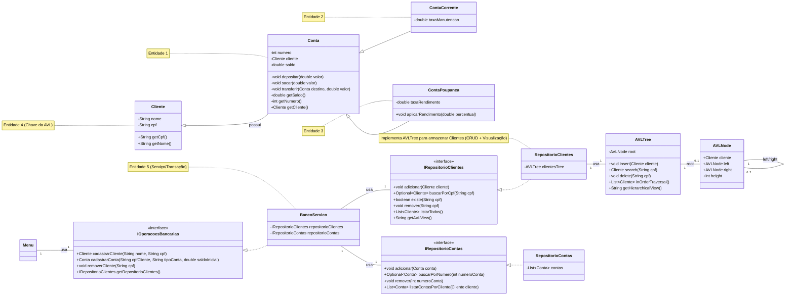

```mermaid
classDiagram
    direction LR
    
    class Cliente {
        -String nome
        -String cpf
        +String getCpf()
        +String getNome()
    }
    
    class Conta {
        -int numero
        -Cliente cliente
        -double saldo
        +void depositar(double valor)
        +void sacar(double valor)
        +void transferir(Conta destino, double valor)
        +double getSaldo()
        +int getNumero()
        +Cliente getCliente()
    }
    
    class ContaCorrente {
        -double taxaManutencao
    }
    
    class ContaPoupanca {
        -double taxaRendimento
        +void aplicarRendimento(double percentual)
    }
    
    class AVLNode {
        +Cliente cliente
        +AVLNode left
        +AVLNode right
        +int height
    }
    
    class AVLTree {
        -AVLNode root
        +void insert(Cliente cliente)
        +Cliente search(String cpf)
        +void delete(String cpf)
        +List~Cliente~ inOrderTraversal()
        +String getHierarchicalView()
    }
    
    class IRepositorioClientes {
        <<interface>>
        +void adicionar(Cliente cliente)
        +Optional~Cliente~ buscarPorCpf(String cpf)
        +boolean existe(String cpf)
        +void remover(String cpf)
        +List~Cliente~ listarTodos()
        +String getAVLView()
    }
    
    class RepositorioClientes {
        -AVLTree clientesTree
    }
    
    class IRepositorioContas {
        <<interface>>
        +void adicionar(Conta conta)
        +Optional~Conta~ buscarPorNumero(int numeroConta)
        +void remover(int numeroConta)
        +List~Conta~ listarContasPorCliente(Cliente cliente)
    }
    
    class RepositorioContas {
        -List~Conta~ contas
    }
    
    class IOperacoesBancarias {
        <<interface>>
        +Cliente cadastrarCliente(String nome, String cpf)
        +Conta cadastrarConta(String cpfCliente, String tipoConta, double saldoInicial)
        +void removerCliente(String cpf)
        +IRepositorioClientes getRepositorioClientes()
    }
    
    class BancoServico {
        -IRepositorioClientes repositorioClientes
        -IRepositorioContas repositorioContas
    }
    
    Cliente <|-- Conta : possui
    Conta <|-- ContaCorrente
    Conta <|-- ContaPoupanca
    
    AVLNode "1" -- "0..2" AVLNode : left/right
    AVLTree "1" -- "0..1" AVLNode : root
    
    IRepositorioClientes <|.. RepositorioClientes
    IRepositorioContas <|.. RepositorioContas
    
    RepositorioClientes "1" -- "1" AVLTree : usa
    
    IOperacoesBancarias <|.. BancoServico
    BancoServico "1" -- "1" IRepositorioClientes : usa
    BancoServico "1" -- "1" IRepositorioContas : usa
    
    Menu "1" -- "1" IOperacoesBancarias : usa
    
    note for RepositorioClientes "Implementa AVLTree para armazenar Clientes (CRUD + Visualização)"
    note for Conta "Entidade 1"
    note for ContaCorrente "Entidade 2"
    note for ContaPoupanca "Entidade 3"
    note for Cliente "Entidade 4 (Chave da AVL)"
    note for BancoServico "Entidade 5 (Serviço/Transação)"
```
